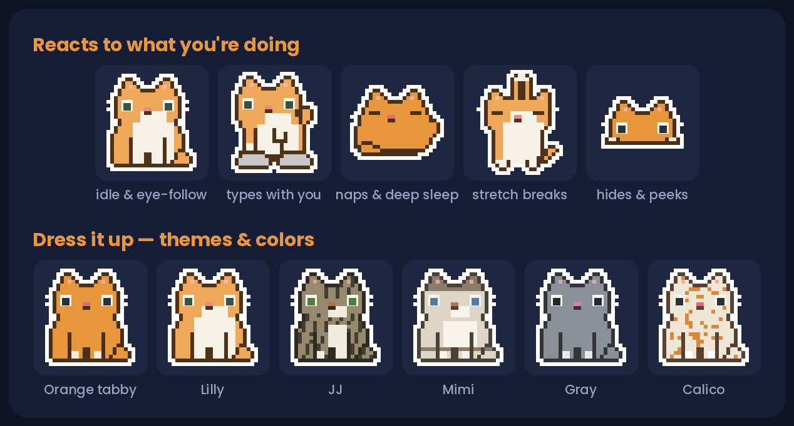

# Neko Cat 🐾

**Neko Cat** adalah aplikasi *desktop pet* interaktif berbasis pixel art yang hidup di layar komputer Anda — menemani mengetik, tidur di atas jendela aplikasi, berjoget mengikuti alunan musik, dan dapat diajak mengobrol menggunakan kecerdasan buatan multi-model AI (*Google Gemini* dan *Bansos Router Multi-Model*).

Dibuat untuk **Windows** dan **Linux**. Ringan, open source, tanpa langganan, dan siap pakai.



🔗 **Repositori Resmi**: [https://github.com/NourAnisa/bot_kucing](https://github.com/NourAnisa/bot_kucing)

---

## 🌟 Fitur Utama

### 1. Interaksi Alami & Reaksi Menggemaskan (Cat Reactions)
- 👀 **Eye Follow** — Pupil mata kucing mengikuti pergerakan kursor mouse di mana pun di layar dan berkedip secara natural.
- 🔴 **Laser Hunt** — Goyangkan kursor ke kiri dan kanan seperti titik laser, kucing akan berlari kencang mengejarnya.
- 🐾 **Purring & Elusan** — Usap kepala kucing dengan mouse selama beberapa detik untuk memicu animasi hati (*hearts*), ekspresi dengkuran (*"purrr..."*), dan efek suara dengkuran asli.
- 🍡 **Mochi Drag** — Tarik tubuh kucing dengan mouse dan ia akan bergelantungan lucu meregang lentur seperti kue mochi.
- 👉 **Nose Boop & Belly Tickle** — Klik ganda pada hidung kucing memicu reaksi kaget bersin lucu (*"Atsyiik! 🤧"*) dengan taburan bintang emas ✨; klik ganda pada perut memicu reaksi gelitik (*"Khehehe geli perutku! 😹"*).
- 🐟 **Fish Snack Treat** — Beri makan ikan segar lewat menu klik kanan; kucing melompat menangkap ikan, menjilati kaki dengan ekspresi bahagia (*"Nyam nyam! Enak banget ikannya! 🐟💖"*).
- 🧶 **Yarn Ball Play** — Lempar bola benang untuk dimainkan kucing; kucing mencakar-cakar gembira (*swatting paws*) mengejar bola benang (*"Catch! Kena bola benangnya! 🧶🐾"*).
- 🤸 **Kinetic Toss & Acrobatic Landing** — Lempar kucing dengan gerakan cepat mouse (*flick drag*); jika dilempar tinggi ke atas kucing membuka parasut pixel darurat (*Emergency Parachute* ☂️), dan jika dilempar mendatar kucing melakukan pendaratan akrobatik 4 kaki (*Cat Righting Reflex* 🤸).
- 💫 **Dizzy Spin React** — Putar kucing berulang-ulang dengan cepat saat di-drag; kucing menjadi pusing dengan bintang berputar (*orbiting stars* 💫) di atas kepalanya (*"@_@ Aduh pusing..."*).
- 🎯 **Stealth Stalking & Pounce** — Gerakkan kursor perlahan mengendap-endap di dekat kucing; kucing akan masuk mode mengintai (*butt wiggle*), lalu menerkam kursor secara tiba-tiba (*"HAP! Kena kamu kursor! 🐾😼"*).
- 😾 **Startle** — Gerakan kursor mendadak dan sangat cepat melintas di dekatnya akan membuatnya melompat kaget.
- ⌨️ **Keyboard Kneading** — Saat Anda mengetik di keyboard, kucing ikut memijat tombol tuts mini 3D di layar secara realtime.
- 🔥 **Overheat Mode** — Jika Anda mengetik sangat cepat (>5.5 ketikan/detik), kucing memerah kepanasan dan mengeluarkan kepulan uap di atas kepalanya.
- 📜 **Paper Unroll** — Scroll mouse Anda dan kucing akan membuka gulungan kertas tisu pixel dengan ujung bergerigi.
- 🎶 **Rhythmic Head Bop** — Saat mendeteksi lagu/musik, selain mengenakan headphone pixel, kucing ikut mengangguk-angguk ritmis mengikuti irama musik dengan notasi balok `♪ ♫` mengambang.
- 🥱 **Wakeup Stretch** — Saat bangun dari tidur siang, kucing meregangkan kaki dan punggungnya (*cat yoga stretch*) sambil menguap segar (*"Hoaamm... menggeliat dulu! 🥱🐾"*).

### 2. Rekan Kerja Produktif & Pengingat Kesehatan 🧘‍♂️
- 🧘‍♂️ **Pengingat Peregangan (Stretch Reminder)** — Menjaga kesehatan ergonomis Anda saat bekerja di depan monitor dengan animasi peregangan kucing lucu. Pilihan interval 20, 30, 45, 60, 90 menit atau kustom, dilengkapi tips panduan peregangan leher, pergelangan tangan, dan mata (metode 20-20-20). Akses instan lewat menu *"Peregangan Sekarang!"*.
- 💧 **Pengingat Minum Air (Water Drink Reminder)** — Pantau hidrasi harian dengan target 8 gelas (~2000 ml). Catat asupan langsung lewat menu *"Catat 1 Gelas Air 🥛 (+250 ml)"*, pantau progres melalui status asupan harian, dan aktifkan alarm pengingat teratur (30/45/60/90 menit).
- 📅 **Pengingat Jadwal Agenda (Schedule Alarm)** — Jadwalkan jam rapat, bimbingan, kuliah, atau kegiatan harian lainnya (`HH:mm`). Neko Cat akan mengeong dan menampilkan balon dialog tepat waktu. Mendukung mode harian (daily) maupun satu kali.
- 💬 **Pengingat Pesan (Message Reminders & Sticky Notes)** — Catat pesan pengingat bebas (misal: *"Matikan kompor"*, *"Kirim laporan"*) berdasarkan jam atau hitungan mundur menit. Juga dapat menyematkan catatan penting melayang di atas kepala kucing (*Pin a note*).
- 🍅 **Pomodoro Timer** — Timer fokus dan istirahat pixel interaktif di samping kucing (preset 25/5 min, 50/10 min, loop, atau kustom).
- 😴 **Napping & Sleep** — Tertidur saat Anda tidak aktif; bangun dengan suara lembut *"mrrp?"*.
- 🧼 **Grooming** — Sesekali berhenti untuk menjilati kaki dan membersihkan diri.
- 🍽️ **Feeding Bowls** *(Opsional)* — Sediakan mangkuk makanan dan air di layar (*Behavior → Feeding bowls*).
- 🪟 **Window Climber** — Kucing bisa memanjat dan duduk di atas jendela aplikasi yang sedang aktif, ikut terbawa saat jendela digeser.
- ☂️ **Parachute Drop** — Jika jendela ditutup saat kucing berada di atasnya, kucing akan membuka parasut pixel dan meluncur anggun ke bagian bawah layar.
- 📺 **Auto-Hide** — Otomatis menyembunyikan diri saat Anda memutar video fullscreen.
- 🎧 **Music Vibes** — Mengenakan headphone pixel saat mendeteksi ada audio atau musik di komputer Anda.

### 3. 🧠 Otak AI Multi-Model (Smart Auto-Failover)
Neko Cat dilengkapi integrasi kecerdasan buatan yang sangat tangguh:
- Tekan **Ctrl + Space** di mana saja untuk memunculkan kotak tanya-jawab (*Ask Neko*).
- **Multi-Model Provider**:
  * **Bansos Router**: Terhubung ke endpoint gratis OpenAI-compatible (`https://noranisa-bansos.hf.space/v1`).
  * **Google Gemini API**: Mendukung Gemini API key pribadi.
- **🔄 Smart Auto-Failover System**:
  Jika model utama mengalami *rate limit* (429) atau *offline* (400), Neko Cat otomatis beralih (*fallback*) secara instan ke model aktif berikutnya:
  1. `fast` *(LLM7 Fast - Ultra Cepat)*
  2. `codestral-latest` *(Mistral Codestral - Koding & Analisis)*
  3. `mistral-Nemo-Instruct-2407` *(Mistral Nemo - 128k Context)*
  4. `default` *(LLM7 Default)*
- **Menu Pemilih Model Instan**: Klik kanan pada kucing ➔ **AI Brain 🧠** ➔ **Pilih Model Router 🔀** untuk berganti model dengan satu klik.

### 4. 🎮 Mini Games Desktop
- 🦆 **Duck Hunt** — Mainkan tembak bebek pixel langsung di desktop Anda dengan musik latar 8-bit retro. Dapatkan 15 tembakan beruntun untuk memicu *Super Saiyan Blue Aura*!
- ✊ **Rock Paper Scissors** — Main suit batu-gunting-kertas cepat melawan Neko Cat.

### 5. Kustomisasi Tampilan Kucing
- 🐱 **Tema Kucing Nyata**: Lilly (Oranye putih), JJ (Tabby abu-abu), dan Mimi (Lynx-point mata biru).
- 🎨 **10 Pilihan Warna Bulu + Custom Color Picker**: Bebas memilih warna apa saja.
- 🧶 **5 Pola Corak**: Tabby, Solid, Tuxedo, Spots, Siamese.
- 👁️ **Warna Mata**: Midnight, Green, Hazel, Blue, Amber, Pink, atau Custom HEX.
- 📏 **7 Pilihan Ukuran**: Mulai dari 2× hingga 10×.
- 🐈🐈 **Multi-Cat**: Dukungan menampilkan lebih dari satu kucing di layar secara bersamaan.

---

## 🚀 Panduan Instalasi & Menjalankan

### Persyaratan Sistem
- **Windows 10 / 11 (64-bit)** atau **Linux** (X11 / Wayland)
- Python 3.9+ (Dilengkapi *offline libraries* di folder `libs/`)

### Cara Menjalankan Langsung (Windows):

1. **Jalankan Aplikasi:**
   Cukup klik dua kali berkas:
   ```cmd
   run.bat
   ```
   Atau jalankan melalui PowerShell / Command Prompt:
   ```cmd
   python nekocat.py
   ```

2. **Membuat Shortcut Desktop:**
   Jalankan:
   ```cmd
   CLICK_ME_TO_INSTALL.bat
   ```
   Shortcut **`Neko Cat.lnk`** akan dibuat otomatis di Desktop Anda.

3. **Mode Debug (Jika Mengalami Kendala):**
   ```cmd
   debug.bat
   ```

### Cara Menjalankan di Linux:
```bash
git clone https://github.com/NourAnisa/bot_kucing.git
cd bot_kucing
./install.sh
./run.sh
```

---

## 📁 Struktur Berkas Proyek

```text
bot_kucing/
├── nekocat.py                     # Program utama Neko Cat (GUI PySide6, AI, event loop)
├── sondercat.py                   # Berkas redirect kompatibilitas mundur
├── sprites.py                     # Definisi matriks pixel art ASCII & palet warna
├── neko_agent.py                  # Penghubung agent CLI
├── neko_antigravity.py            # Integrasi IDE Antigravity
├── neko_brave_userscript.user.js  # Ekstensi connector browser Brave
├── run.bat / run.sh               # Skrip peluncur cepat
├── debug.bat                      # Skrip peluncur mode debug
├── CLICK_ME_TO_INSTALL.bat        # Skrip installer desktop sekali klik
├── neko_cat_setup.exe             # Portable setup executable
├── nekocat_gray.ico               # Ikon aplikasi
├── meow.wav                       # Suara meong asli
├── sounds/                        # Efek suara dengkuran (purr_pet, purr_sleep)
├── assets/                        # Gambar dokumentasi & preview
├── ai_office/                     # Dashboard AI Office & sistem monitoring
├── whatsapp_bot/                  # Server bot customer service WhatsApp
└── libs/                          # Dependensi offline PySide6 & pynput
```

---

## 🎨 Mengubah / Mengedit Desain Pixel Art

Seluruh pose animasi digambar menggunakan matriks teks pixel di [`sprites.py`](sprites.py). Anda dapat mengeditnya secara langsung saat aplikasi berjalan:
1. Klik kanan pada kucing ➔ **Animations** ➔ **Open animations file**.
2. Centang **Auto-reload on save**.
3. Buka file `sprites.py` di code editor, lakukan perubahan, dan tekan **Ctrl + S**. Desain kucing di layar akan langsung berubah secara realtime!
4. Panduan lengkap sintaks pixel art tersedia di [`ANIMATIONS.md`](ANIMATIONS.md).

---

## 📜 Lisensi & Atribusi

Proyek ini dirilis di bawah lisensi **Apache License 2.0**.  
* Terinspirasi oleh konsep *Comnyang* (macOS).
* Dikembangkan dan disesuaikan dari basis arsitektur *SondeR-Cat* oleh Verisonder.
* Rebrand & Ekosistem Multi-Model AI Router dikembangkan untuk **Neko Cat** oleh Nor Anisa / Noura Studio.
* Rincian lisensi lengkap dapat dilihat pada berkas [`LICENSE`](LICENSE) dan [`NOTICE`](NOTICE).
